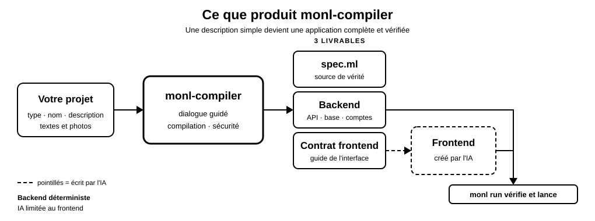

# monl-compiler

**Un compilateur qui transforme une spécification déclarative en backend complet, déterministe et sûr.**

[](https://github.com/Bodichane/monl-compiler/actions/workflows/ci.yml)
[](CHANGELOG.md)
[](pyproject.toml)
[](tests/)
[](#qualité-et-vérification)
[](LICENSE)

On décrit l'intention d'une application dans un DSL dédié ; monl-compiler en génère la base
de données, l'API REST, l'authentification et le contrôle d'accès — puis produit un
contrat que le frontend doit respecter. **La spécification est l'unique source de
vérité** : on ne maintient pas le code d'infrastructure à la main.

Un dialogue guidé aide à rédiger cette spécification sans connaître la syntaxe.
Son mode express demande seulement le type de site, son nom et une phrase de
description ; monl-compiler prépare ensuite la structure, les données de démonstration et
un brief éditorial complet. Le seul recours à l'IA se situe au bout de la chaîne,
pour construire le frontend à partir du contrat garanti par le compilateur —
**jamais** pour le backend, les permissions ni la logique métier.

---

## Sommaire

- [Démarrage rapide](#démarrage-rapide)
- [Pourquoi monl-compiler ?](#pourquoi-monl-compiler-)
- [Architecture](#architecture)
- [Commandes](#commandes)
- [La spécification](#la-spécification)
- [Le backend généré](#le-backend-généré)
- [Photos, logo et favicon](#vos-fichiers--photos-logo-favicon)
- [Remplacer le contenu sans ouvrir le DSL](#remplacer-le-contenu-sans-ouvrir-le-dsl)
- [Le frontend : contrat et IA spécialisée](#le-frontend--contrat-et-ia-spécialisée)
- [Qualité et vérification](#qualité-et-vérification)
- [Structure du dépôt](#structure-du-dépôt)
- [Documentation](#documentation)

---

## Démarrage rapide

`monl` ouvre le dialogue guidé. Choisissez une catégorie, puis **Création rapide
avec l'IA** : trois réponses suffisent pour produire la spécification, le backend
et le contrat frontend. Cette première étape reste déterministe, sans modèle et
sans appel réseau. L'IA intervient ensuite uniquement pour dessiner l'interface.

```bash
pip install .
monl
monl frontend MonProjet --provider codex
monl run MonProjet
```

Les fournisseurs frontend par API nécessitent l'extra optionnel :
`pip install 'monl-compiler[ai]'`. Les agents locaux et `monl import` n'en ont
pas besoin.

Le parcours **Personnalisation détaillée** reste disponible pour choisir chaque
option, rôle, contenu éditorial et intention visuelle. Sans agent local ni clé
API, ouvrez `FRONTEND_PROMPT.md` dans l'IA de votre choix, puis installez le ZIP
ou le fichier HTML obtenu avec `monl import`.

> **Ubuntu / Debian.** Le Python système est protégé (PEP 668) : préférez
> `pipx install .` à `pip install . --break-system-packages`.

Le parcours complet, interface comprise, est détaillé dans
[QUICKSTART.md](QUICKSTART.md).

## Pourquoi monl-compiler ?

| | Framework classique<br><sub>Django, Rails, FastAPI…</sub> | Générateur d'IA<br><sub>v0, Bolt, assistants de code</sub> | **monl-compiler** |
|---|---|---|---|
| **Code d'infrastructure** | écrit et maintenu à la main | produit une fois, à reprendre ensuite | **dérivé de la spec, jamais maintenu** |
| **Deux compilations identiques** | sans objet | résultat différent à chaque fois | **le même backend, à l'octet près** |
| **Contrôle d'accès** | vérifié route par route, à la vigilance | ce que le modèle a compris | **vérifié à la compilation : une collision de privilèges empêche de compiler** |
| **Cohérence schéma / API / règles** | trois endroits à synchroniser | aucune garantie | **une source unique, propagée à la recompilation** |
| **Sécurité** | dépend de l'auteur | espérée | **acquise par construction : requêtes paramétrées, rôle issu du compte réel, secret hors du code** |
| **Rôle de l'IA** | aucun | écrit tout, backend compris | **cantonnée au frontend, encadrée par un contrat et un smoke test** |
| **Évolution du schéma** | migrations à écrire | à reprendre à la main | **additive et non destructive, données préservées** |

**Ce que vous écrivez :** une spécification d'une page. **Ce que vous
modifiez, ensuite :** la même page. Le code produit se recompile ; il n'est
jamais un point de départ à retoucher.

## Architecture



Le dialogue produit la spécification ; le compilateur en dérive **à la fois** le
backend et le contrat frontend ; l'IA écrit l'interface contre ce contrat ;
`monl run` vérifie que les trois restent cohérents avant de lancer l'application.

## Commandes

### Plateforme web et MCP

Le compilateur peut aussi être utilisé sans cloner le dépôt sur la machine de
l'utilisateur. La plateforme web explique Monl, valide une spec, compile le
backend, expose son contrat et livre une archive sans secret :

```bash
monl-platform --port 8022
```

Les agents compatibles MCP peuvent appeler le même pipeline avec `monl-mcp`
en stdio ou le point HTTP `/mcp`. Aucun second générateur n'est maintenu : CLI,
web et MCP délèguent tous à `compile_project`.

Voir [Plateforme web et serveur MCP](docs/PLATFORME_ET_MCP.md).

| Commande | Ce qu'elle fait |
|---|---|
| `monl` | Dialogue guidé → `spec.ml` + backend + contrat frontend |
| `monl compile <spec.ml> --output <dir>` | Compile une spécification existante |
| `monl frontend <App>` | L'IA écrit l'interface dans `frontend/` |
| `monl import <zip\|html\|dossier> <App>` | Installe un frontend obtenu sans clé API |
| `monl run <App>` | Vérifie la cohérence, joue le smoke test, puis lance |
| `monl update <App>` | Recompile après évolution de la spec, préserve les données |
| `monl assets add <fichier> --for "<fiche>"` | Installe une photo et la déclare dans la spec |
| `monl assets list <App>` | Ce que la spec déclare, ce qui est présent, ce qui traîne |
| `monl content export <App>` | Exporte les fiches de démonstration vers `content/*.csv` |
| `monl content import <App>` | Remplace les fiches depuis les CSV, puis revalide toute la spec |

Chaque projet se compile dans son propre dossier via `--output`, afin de ne pas
écraser le précédent. Les spécifications portent l'extension `.ml`.

## La spécification

Une spec décrit des **entités** (tables et champs), des **acteurs** (rôles) et des
**règles** d'accès. Le compilateur en dérive le schéma, les routes CRUD et le
contrôle d'accès. Les identifiants sont contraints par la grammaire, ce qui exclut
toute injection par les noms de tables ou de colonnes.

**Le contrôle d'accès s'exprime au niveau de l'enregistrement, lecture comprise :**

| Règle | Effet |
|---|---|
| `rule Entite.Action ownedBy Acteur` | Seul le propriétaire (relation auto-peuplée à la création) peut agir — **le filtrage couvre aussi la lecture**, liste et accès direct |
| `rule Entite.Action accessibleBy col1, col2` | Réservé aux parties référencées par l'enregistrement (messagerie privée : expéditeur et destinataire) |
| `rule Entite.Action public` | Retire l'authentification d'une action précise (galerie publique, formulaire de contact) |
| `rule Article.Read publicWhen status "published"` | Lecture publique **sous condition** : liste filtrée, détail en 404. Un `sharedBy` sur la même référence exempte les modérateurs ; le propriétaire retrouve toujours les siens |
| `rule Vote.Create oncePer Participant, Entry` | Index unique composite : un compte ne peut effectuer l'action qu'une fois par cible |

**Les contraintes de champ sont appliquées, pas seulement déclarées :**

| Règle | Effet |
|---|---|
| `rule Produit.prix min 0` | Borne d'entrée — **422 avant tout INSERT**. Valeur sur les types nombre, longueur sur les types texte |
| `rule Membre.pseudo unique` | Index unique en base — un doublon répond 409, à la création comme à la modification |
| `rule Produit.nom required` | Assertion vérifiée : le champ doit exister (les schémas rendent déjà tout champ obligatoire) |
| `rule Ligne.Create decrements Produit.stock by quantite` | Décompte **la quantité demandée**, et refuse en 409 de passer sous le `min` déclaré |
| `rule Commande.passeeLe timestamp` | Date de création écrite par le **serveur** (ISO 8601 UTC), absente des corps de requête — création comme modification |
| `rule Commande.statut oneOf "panier", "expédiée"` | Refuse toute autre valeur à la création comme à la modification |
| `rule Commande.statut "annulée" releases Ligne` | Rend le stock une seule fois lorsque la commande est annulée |
| `rule Commande.statut writableAfterPayment Admin` | Réserve ce champ à une route authentifiée dédiée ; les totaux calculés restent inaccessibles |

D'autres marqueurs affinent champs et comportement : `hidden`, `generated`,
`categorized`, `derivedFrom` / `sumOf` (montants calculés par le serveur),
`payable` (encaissement, ci-dessous), ainsi qu'un bloc `seed` idempotent qui
pré-remplit la base au démarrage. Une règle sans effet est **refusée à la
compilation** plutôt qu'ignorée en silence — et une règle qui désigne un champ
inexistant aussi : une contrainte à laquelle rien ne correspond laisse croire à
une protection qui n'existe pas.

<details>
<summary><b>Encaisser : <code>rule Commande.total payable</code></b></summary>

<br>

La règle nomme le champ qui porte le **montant** ; l'entité qui le contient est
celle qu'on encaisse. monl-compiler en dérive deux colonnes de suivi et deux routes —
`POST /commande/{id}/paiement`, qui ouvre une session de règlement, et
`POST /paiement/webhook`, qui reçoit la confirmation du prestataire.

**Le montant vient de la base, jamais du client.** La route de règlement
n'accepte aucun corps de requête : elle relit le champ à chaque appel. Un panier
qui envoie son propre prix est un panier qu'on peut négocier. Le webhook, lui,
vérifie la signature du prestataire avant d'écrire quoi que ce soit — c'est le
seul endroit du backend généré où un tiers non authentifié touche à la base.

Six situations sont refusées **à la compilation** plutôt qu'au moment
d'encaisser : entité ou champ inexistant, champ non numérique, cumul avec
`hidden` (un montant illisible est invérifiable par celui qui le règle), deux
champs `payable` sur une même entité (plus rien ne dit lequel encaisser), et
création `public` (un paiement exige un appelant identifié).

Les clés (`STRIPE_SECRET_KEY`, `STRIPE_WEBHOOK_SECRET`) viennent de
l'environnement, comme le secret JWT. Absentes, les routes répondent 503 **en
nommant la variable manquante** et le reste du serveur fonctionne normalement :
un projet fraîchement compilé se lance et se teste hors ligne.

</details>

<details>
<summary><b>Inscription : pourquoi un rôle ne s'obtient pas en un appel HTTP</b></summary>

<br>

Un acteur n'est pas inscriptible par défaut. `actor Client selfRegister` ouvre
`POST /register` à ce rôle ; un `actor Admin` sans marqueur ne peut être obtenu que
par provisionnement hors ligne (`manage.py`, généré à côté du backend). Laisser le
client choisir son rôle à l'inscription serait une élévation de privilège en un
appel HTTP.

</details>

**Cinq spécifications de référence**, commentées, dans
[`exemples/`](exemples/) : un fichier `.ml` d'une page par application —
portfolio, boutique, réseau social, kanban, classement — dont monl-compiler dérive tout
le reste.

<details>
<summary><b>Direction visuelle : elle ne vient pas du compilateur</b></summary>

<br>

monl-compiler n'a **aucun** avis sur le visuel — ni palette, ni typographie, ni grille.
Il ne sait pas à quoi un projet doit ressembler ; il ne connaît que des noms de
tables. La direction est celle que l'auteur formule dans le dialogue (registre
visuel, place des images) : elle voyage dans le brief, et c'est l'IA
d'interface qui la sert.

Deux exigences seulement subsistent, et ce ne sont pas des questions de goût :
le **contraste** (WCAG AA), qui rend l'interface lisible, et l'**autonomie** du
frontend, qui la rend vérifiable par le smoke test.

</details>

## Le backend généré

**Comptes et rôles.** `POST /register` n'accepte que les rôles marqués
`selfRegister` ; tout autre est refusé (403). Les comptes privilégiés se créent
avec le `manage.py` généré, sur la machine qui héberge la base :
`python3 manage.py adduser <utilisateur> <role>`. La même commande gère rôle, mot
de passe, liste des comptes et révocation globale des sessions.

**Authentification.** Registre d'utilisateurs propre à chaque application (table
`_monl_users`, mots de passe en PBKDF2-HMAC-SHA256, sel unique par compte,
comparaison à temps constant). Flux : `POST /register` → `POST /login` (jeton JWT)
→ `POST /logout` (révocation avant expiration). **Le rôle et l'identité portés par
le jeton proviennent du compte réel**, jamais d'une déclaration du client.

**Secret JWT.** Généré aléatoirement à la première compilation, stocké dans
`.jwt_secret` (jamais versionné). En production, `MONL_JWT_SECRET` est prioritaire
et permet de livrer un projet sans secret sur le disque.

**Multi-workers.** Révocation de jetons et limitation de débit (5 tentatives /
60 s / IP sur `/register` et `/login`) sont persistées en base, donc partagées :
`uvicorn app:app --workers N` n'en démultiplie pas les quotas. Derrière un reverse
proxy de confiance, `MONL_TRUST_PROXY=1` fait lire l'IP réelle dans
`X-Forwarded-For` ; sans ce réglage l'en-tête est ignoré, pour empêcher toute
usurpation.

**Migrations.** Recompiler dans le même dossier, en conservant `app.db`, ajoute les
colonnes par `ALTER TABLE ADD COLUMN` sans toucher aux données. Les changements
destructifs ne sont pas automatisés, à dessein — voir [docs/MIGRATIONS.md](docs/MIGRATIONS.md).

**Routes servies.** `/docs` (Swagger, toujours disponible) · `/` (redirige vers
`/docs`) · `/site` (l'interface, si `frontend/` existe et que l'app est lancée par
`monl run`).

## Vos fichiers : photos, logo, favicon

Une image cassée ne se voit qu'à l'œil, en ligne — le pire endroit pour découvrir
une faute de frappe. Les fichiers que vous fournissez se déclarent donc dans la
spec, et le compilateur **refuse de compiler s'ils ne sont pas là** :

```monl
assets
    dir: "assets"
    logo: "logo.svg"

entity Produit
    photo: Image          # un fichier LOCAL, vérifié présent
```

`Image` désigne un fichier du projet : une URL y est refusée, parce que monl ne
fait aucun appel réseau et ne pourrait rien affirmer d'une adresse distante —
`String` reste là pour ce cas, non vérifié. Le dossier vit **hors de
`frontend/`**, qui est renommé à chaque reconstruction du frontend.

Pour ne pas écrire ces chemins à la main :

```bash
monl assets add ~/photos/IMG_4821.jpg --for "Halo RS"   # → assets/halo-rs.jpg
monl assets add ~/logo.svg --logo
monl assets list                                        # présents, manquants, orphelins
```

La commande copie le fichier, le renomme en slug, écrit la déclaration — puis fait
**revalider la spec obtenue par le compilateur avant de l'enregistrer**. En cas de
refus, ni la spec ni le dossier ne sont modifiés. Elle ne supprime jamais un
fichier : remplacer une photo signale l'ancienne comme orpheline, elle ne l'efface
pas.

## Remplacer le contenu sans ouvrir le DSL

Le seed de démonstration permet de voir immédiatement une interface, mais il
n'est pas destiné à devenir le vrai catalogue. Un humain peut remplacer textes,
prix et noms de photos avec un tableur :

```bash
monl content export MonProjet
# modifier content/Produit.csv et déposer les photos dans assets/
monl content import MonProjet
monl update MonProjet
```

Chaque CSV conserve l'ordre des champs et des fiches. `LISEZMOI.txt` explique en
français les valeurs permises, les champs obligatoires, les bornes et les images
attendues. Une cellule vide est omise : c'est le vrai compilateur qui décide si
elle était obligatoire. Les nombres invalides, fichiers absents, chemins suspects
et blocs ambigus sont refusés avant toute écriture. L'import remplace le contenu
complet de l'entité ; il ne fusionne jamais silencieusement deux sources de
vérité.

## Le frontend : contrat et IA spécialisée

L'interface est écrite par une IA, à partir de deux documents que chaque
compilation produit :

- `frontend_contract.json` — description machine-lisible des routes destinées à
  l'interface, de l'authentification et des règles de champ, dérivée de la même
  spec que le backend ;
- `FRONTEND_PROMPT.md` — un brief prêt à confier à une IA d'interface : structure,
  rôles, contenu et intention déclarée, sans aucune prescription visuelle.

L'IA écrit dans `frontend/` (point d'entrée `index.html`), que `monl run` sert sur
`/site` sans jamais toucher au backend. Plusieurs voies, mêmes garde-fous :

| Voie | Commande | Authentification |
|---|---|---|
| Manuelle | déposer les fichiers dans `frontend/` | — |
| Copier-coller | `monl import <zip\|html\|dossier> <App>` | aucune |
| Agent local | `monl frontend <App> --provider claude-code\|codex\|gemini` | abonnement de l'agent |
| Agent quelconque | `monl frontend <App> --agent-command "<cmd> {instruction}"` | celle de l'agent |
| API Anthropic | `monl frontend <App> --provider claude` | `ANTHROPIC_API_KEY` |
| API tierce | `monl frontend <App> --provider groq --model <id>` | `GROQ_API_KEY`, etc. |

**N'importe quelle clé fait l'affaire.** Les fournisseurs au dialecte OpenAI —
`groq`, `openai`, `openrouter`, `deepseek`, `mistral`, `together`, `xai`,
`ollama` — sont préréglés, chacun lisant sa propre variable d'environnement. Pour
un point de terminaison absent de cette liste, `--provider openai-compatible`
avec `MONL_AI_BASE_URL` et `MONL_AI_API_KEY`. Hors voie Anthropic, `--model` est
exigé : monl ne code aucun identifiant de modèle en dur, les catalogues changeant
trop vite pour qu'une valeur figée reste vraie. La clé se lit toujours dans
l'environnement, jamais en argument — le shell l'archiverait.

Garde-fous communs : extensions en liste blanche, protection contre le zip-slip,
frontend autonome sans CDN, et re-vérification systématique.

### Sans clé API, sans carte bancaire, sans réseau

**Le compilateur n'appelle jamais l'extérieur.** `monl compile` produit `app.py`,
`schema.sql`, `manage.py`, le contrat et le brief entièrement hors ligne : le
parseur, le validateur et le générateur ne contiennent aucun appel réseau. Tout
le backend — routes, base, JWT, contrôle d'accès, paiement, back-office —
s'obtient sans compte chez qui que ce soit.

L'IA n'intervient qu'à l'étape frontend, et cette étape a une voie **sans aucune
clé** :

```bash
monl compile boutique.ml --output ./Boutique   # hors ligne
# coller le contenu de Boutique/FRONTEND_PROMPT.md dans n'importe quel
# assistant accessible par navigateur, récupérer le résultat…
monl import interface.zip ./Boutique           # mêmes garde-fous, même vérification
monl run ./Boutique
```

`monl import` n'est pas une porte dérobée : la source vient d'une conversation,
elle est donc traitée comme une entrée non fiable — liste blanche d'extensions,
refus du zip-slip, refus des CDN, `index.html` obligatoire, puis contrôle de
cohérence et smoke test, exactement comme une réponse d'API.

Restent, selon ce que vous avez sous la main : `--provider ollama` pour un modèle
entièrement local, les agents en ligne de commande qui s'authentifient par
abonnement plutôt que par clé, et les fournisseurs au dialecte OpenAI dont
plusieurs proposent un palier gratuit. monl n'en privilégie aucun et n'en revend
aucun : il ne consomme aucun jeton pour son propre compte.

> **Ce qui est prouvé, et ce qui ne l'est pas.** Le parcours hors ligne, la voie
> copier-coller et la voie Anthropic sont éprouvés de bout en bout contre un vrai
> serveur. Les préréglages `codex` et `gemini` sont écrits et couverts au niveau
> de la plomberie, mais n'ont pas été éprouvés contre les binaires réels — les
> employer, c'est essuyer les plâtres.

**Avant tout lancement**, `monl run` exécute un smoke test comportemental sur un
serveur éphémère à base neuve : chaque route du contrat est éprouvée en HTTP réel
et, si Node.js est présent, `frontend/index.html` est exécuté dans jsdom contre ce
serveur. Toute exception ou tout appel hors contrat bloque le lancement
(`--skip-smoke` pour outrepasser en connaissance de cause).

## Qualité et vérification

| | |
|---|---|
| **832 tests validés lors du dernier audit** | Validations unitaires et serveurs éphémères pour les parcours HTTP ; le nombre officiel est celui publié par la CI |
| **Couverture publiée par la CI** | `pytest --cov=src --cov-report=term-missing` |
| **Audit offensif** | Usurpation de rôle, JWT forgé, élévation de privilège |
| **Frontières d'architecture** | Six contrats d'import vérifiés par un test, pas par la mémoire |
| **Lint** | `ruff check src tests` — zéro signalement, exceptions justifiées dans `pyproject.toml` |
| **CI** | Python 3.10, 3.12 et 3.14 à chaque push ; `main` protégée par ces vérifications |

```bash
python3 -m pytest tests/ -q --cov=src --cov-report=term-missing
```

```bash
ruff check src tests
```

```bash
python3 -m mypy src/monl/ir.py src/monl/errors.py src/monl/generator/emitters.py --strict
vulture src/monl --min-confidence 90
```

monl-compiler ne dépend d'aucun modèle d'IA et ne fait aucun appel réseau :
dialogue, spécification et génération du backend sont entièrement déterministes.
Les blocs `custom` produisent des coquilles vides sûres dans `sandbox_ai.py`, dont
la logique métier est écrite à la main — aucune génération de code n'est
automatisée.

## Structure du dépôt

| Dossier | Contenu |
|---|---|
| `src/monl/` | Le paquet : parseur, validateur, dialogue, contrat frontend, CLI |
| `src/monl/generator/` | Le générateur de backend, une couche par module |
| `exemples/` | Cinq spécifications `.ml` d'une page, compilées à chaque test |
| `demo/` | La démo StudioNova : sa spécification et son frontend |
| `tests/` | Non-régression, audit offensif, frontières d'architecture |
| `docs/` | Décisions de conception, sécurité, migrations |

## Documentation

| Fichier | Contenu |
|---|---|
| [QUICKSTART.md](QUICKSTART.md) | Le parcours complet, en trois étapes |
| [docs/design_decisions.md](docs/design_decisions.md) | Le journal du projet : 115 points, chacun avec son *pourquoi* |
| [docs/SECURITE.md](docs/SECURITE.md) | Modèle de sécurité |
| [docs/MIGRATIONS.md](docs/MIGRATIONS.md) | Évolution du schéma sans perte |
| [docs/BETA.md](docs/BETA.md) | État de la bêta et feuille de route |
| [docs/DEPRECATIONS.md](docs/DEPRECATIONS.md) | Compatibilités historiques et politique de retrait |
| [CHANGELOG.md](CHANGELOG.md) | Historique des versions |
| [CONTRIBUTING.md](CONTRIBUTING.md) | Méthode de travail, règles du dépôt, checklist avant PR |

## Licence

**FSL-1.1-ALv2** — *Functional Source License*, avec bascule automatique vers
**Apache-2.0 deux ans après la publication de chaque version**
([LICENSE](LICENSE)).

Vous pouvez utiliser monl-compiler librement, y compris en contexte
professionnel, le modifier, le redistribuer, et **vous en servir pour livrer
des applications à vos clients**. La seule restriction est l'usage
*concurrent* : en faire un produit ou un service commercial qui se substitue à
monl-compiler. Les applications *produites* à partir de vos propres
spécifications vous appartiennent.

Le détail en français : [LICENSE-FAQ.md](LICENSE-FAQ.md).

Les rapports de bug et remarques sont bienvenus dans les *issues*.

---

**monl-compiler 0.9.0-beta.7**
