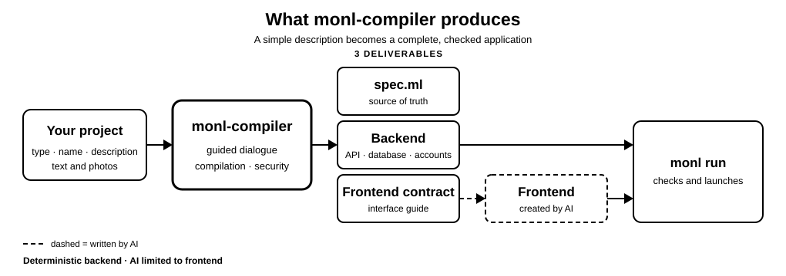

# monl-compiler

Describe your app in one short text file; monl builds the backend — database, API, user accounts and permissions.

```monl
app MyProjects
entity Project
    title: String
    description: Text
actor Visitor selfRegister
actor Admin
rule Project.Read public
workflow Browse for Visitor
    Read Project
workflow Manage for Admin
    Create Project
seed Project
    title: "First project", description: "Ready to explore."
```

→ **You get:** a running API (routes your website can call) with an interactive
`/docs` page, sign-up and login, a SQLite database with demo data, and
`manage.py` to create admins. This example's public `/project` route returns
`First project` immediately. The `seed` block supplies those demo records.

The same file and compiler version always give the same backend code, with no
AI and no network. Custom business logic is left as empty stubs for you to
implement. The website UI is optional: AI can draw it from the **frontend
contract**, a description of the API routes, fields and permissions it must follow.

To change the app, edit the file and recompile; never edit generated code.

[](https://github.com/Bodichane/monl-compiler/actions/workflows/ci.yml)
[](CHANGELOG.md)
[](pyproject.toml)
[](LICENSE)

---

## Contents

- [Quick start](#quick-start)
- [Why monl-compiler?](#why-monl-compiler)
- [Architecture](#architecture)
- [Commands](#commands)
- [The specification](#the-specification)
- [The generated backend](#the-generated-backend)
- [Your files: photos, logo, favicon](#your-files-photos-logo-favicon)
- [Replace content without opening the spec](#replace-content-without-opening-the-spec)
- [The frontend: contract and specialized AI](#the-frontend-contract-and-specialized-ai)
- [Quality and verification](#quality-and-verification)
- [Repository structure](#repository-structure)
- [Documentation](#documentation)
- [License](#license)

---

## Quick start

Allow about 5–10 minutes for installation and your first backend; adding an
AI-built interface takes extra time depending on your provider.
`monl` opens a guided dialogue so you can write the spec without knowing its syntax. Its express mode asks for the site type,
name and a one-sentence description, then prepares the specification, demo
data and a **brief** (instructions describing the content and intended interface).
The dialogue's “Quick creation with AI” label refers to the later interface
step: specification and backend generation use no model and no network call.
At the end, open http://127.0.0.1:8000/docs to explore the API;
if you add an interface, open http://127.0.0.1:8000/site.

```bash
pip install monl-compiler
monl
monl frontend MyProject --provider codex
monl run MyProject
```

From a repository clone, `pip install .` installs the same thing.

Frontend providers that use an API require the optional extra:
`pip install 'monl-compiler[ai]'`. Local agents and `monl import`
do not need it.

The **Detailed customization** workflow remains available for choosing every
option, role, editorial content item, and visual intention. Without a local agent or API key, open
`MyProject/docs/FRONTEND_PROMPT.md` in the AI of your choice, then
install the resulting ZIP or HTML file with `monl import`.

The full workflow, including the interface, is described in
[QUICKSTART.md](QUICKSTART.md).

## Why monl-compiler?

| | Traditional framework<br><sub>Django, Rails, FastAPI…</sub> | AI generator<br><sub>v0, Bolt, coding assistants</sub> | **monl-compiler** |
|---|---|---|---|
| **Infrastructure code** | written and maintained by hand | produced once, then taken over | **derived from the spec, never maintained** |
| **Two identical compilations** | not applicable | different result each time | **identical backend sources for identical input and compiler version** |
| **Access control** | checked route by route, relying on diligence | what the model understood | **checked at compilation: a privilege collision prevents compilation** |
| **Schema / API / rules consistency** | three places to synchronize | no guarantees | **one source, propagated on recompilation** |
| **Security** | depends on the author | depends on generated code and its review | **generated safeguards: parameterized queries, role taken from the actual account, secret kept out of code** |
| **Role of AI** | none | writes everything, including the backend | **limited to the frontend, bounded by a contract and a smoke test (a quick automatic test that starts the app and calls its routes)** |
| **Schema evolution** | migrations to write | manual rework | **additive and non-destructive, data preserved** |

**What you write:** a one-page specification. **What you
change afterward:** that same page. The generated code is recompiled; it is
never a starting point to edit.

These safeguards cover the rules supported by the compiler; they
do not guarantee an application's overall security. The suitability of the
declared permissions, `custom` code, the frontend, dependencies, and
operations require their own checks. Generated sources
are deterministic; secrets created for each project and runtime data
are not part of that identity. See the
[security model](docs/SECURITE.md) and the [operations guide](docs/EXPLOITATION.md).

## Architecture



The dialogue produces the specification; the compiler derives both the
backend and the frontend contract from it; AI writes the interface against this contract;
`monl run` checks that all three remain consistent before launching the application.

## Commands

| Command | What it does |
|---|---|
| `monl` | Guided dialogue → `spec.ml` + backend + frontend contract |
| `monl compile <spec.ml> --output <dir>` | Compiles an existing specification |
| `monl frontend <App>` | AI writes the interface in `frontend/` |
| `monl import <zip\|html\|folder> <App>` | Installs a frontend obtained without an API key |
| `monl retouche "<what looks wrong>" <App>` | Fixes a display issue without rebuilding the site |
| `monl run <App>` | Checks consistency, runs the smoke test, then launches |
| `monl diff <App>` | Shows the contract delta (changes to routes, fields and permissions) **without recompiling or writing anything** |
| `monl update <App>` | Recompiles after spec changes, preserves data |
| `monl migrate <App> --name <name>` | Applies (or undoes with `--down`) a named schema migration |
| `monl usage <App>` | Measures AI usage and the project's declared cost |
| `monl assets add <file> --for "<record>"` | Installs a photo and declares it in the spec |
| `monl assets list <App>` | What the spec declares, what is present, and what is left over |
| `monl content export <App>` | Exports demo records to `content/*.csv` |
| `monl content import <App>` | Replaces records from CSV files, then revalidates the entire spec |

Each project is compiled in its own directory through `--output`, so the previous one is not
overwritten. Specifications use the `.ml` extension.

### Claude Code plugin

The repository is also a Claude Code plugin marketplace. The `monl-compiler`
plugin teaches Claude to write a spec from examples, compile it, check it
against a real server, and then build its interface:

```bash
claude plugin marketplace add Bodichane/monl-compiler
claude plugin install monl-compiler@monl-compiler
```

In a session, use `/monl-compiler:monl-spec` followed by what the application should do.
The skill calls the command line through `uvx`, without prior
installation, using the plugin version. The plugin is published in Anthropic's
directory: install it from the directory, or use the two commands above.

### Web platform and MCP

The compiler is also available through a web platform: it validates a
spec, compiles the backend, exposes its contract, and delivers an archive without secrets:

```bash
monl-platform --port 8022
```

MCP-compatible agents can call the same pipeline with `monl-mcp`
over stdio or the HTTP endpoint `/mcp`. No second generator is maintained: the CLI,
web, and MCP all delegate to `compile_project`.

See [Web platform and MCP server](docs/PLATFORME_ET_MCP.md).

In production, `compose.platform.yaml` launches the application as a
non-root user with persistent storage, readiness checks, shared quotas, and isolated compilations. The port remains bound to localhost so it can be published behind an HTTPS reverse
proxy. The reproducible procedure (variables, DNS, TLS, backups, and
probes) is detailed in [the deployment runbook](deploy/README.md).

## The specification

A spec describes **entities** (tables and fields), **actors** (roles), and
access **rules**. The compiler derives the schema, CRUD routes, and access control from it. Identifiers are constrained by the grammar, which rules out
injection through table or column names.

**Access control is expressed at the record level, including reads:**

| Rule | Effect |
|---|---|
| `rule Entite.Action ownedBy Acteur` | Only the owner (a relation auto-populated on creation) can act — **filtering also covers reads**, both lists and direct access |
| `rule Entite.Action accessibleBy col1, col2` | Restricted to the parties referenced by the record (private messaging: sender and recipient) |
| `rule Entite.Action public` | Removes authentication from a specific action (public gallery, contact form) |
| `rule Article.Read publicWhen status "published"` | Conditional public read: filtered list, detail returns 404. A `sharedBy` on the same reference exempts moderators; the owner can always retrieve their own records |
| `rule Vote.Create oncePer Participant, Entry` | Composite unique index: an account can perform the action only once per target |

**Field constraints are enforced, not merely declared:**

| Rule | Effect |
|---|---|
| `rule Produit.prix min 0` | Input bound — **422 before any INSERT**. Value for number types, length for text types |
| `rule Membre.pseudo unique` | Unique database index — a duplicate returns 409, on both creation and modification |
| `rule Produit.nom required` | Checked assertion: the field must exist (schemas already make every field required) |
| `rule Ligne.Create decrements Produit.stock by quantite` | Decrements **the requested quantity**, and refuses with 409 to go below the declared `min` |
| `rule Commande.passeeLe timestamp` | Creation date written by the **server** (ISO 8601 UTC), absent from request bodies — on both creation and modification |
| `rule Commande.statut oneOf "panier", "expédiée"` | Refuses any other value on both creation and modification |
| `rule Commande.statut "annulée" releases Ligne` | Restores stock once when the order is cancelled |
| `rule Commande.statut writableAfterPayment Admin` | Restricts this field to a dedicated authenticated route; calculated totals remain inaccessible |

Other markers refine fields and behavior: `hidden`, `generated`,
`categorized`, `derivedFrom` / `sumOf` (amounts calculated by the server),
`payable` (payment collection, below), as well as a `seed` block (demo records inserted at startup without duplicating them) that
pre-populates the database. A rule with no effect is **refused at
compilation** rather than silently ignored — and so is a rule that names a
nonexistent field: a constraint that matches nothing gives the impression of
protection that does not exist.

<details>
<summary><b>Collecting payment: <code>rule Commande.total payable</code></b></summary>
<br>

The rule names the field that carries the **amount**; the entity that contains it
is the one being charged. monl-compiler derives two tracking columns and two
routes from it — `POST /commande/{id}/paiement`, which opens a payment session,
and `POST /paiement/webhook`, which receives the provider's confirmation.

**The amount comes from the database, never from the client.** The payment route
accepts no request body: it rereads the field on every call. A cart that sends
its own price is a cart whose price can be negotiated. The webhook, in turn,
checks the provider's signature before writing anything — it is the only place
in the generated backend where an unauthenticated third party touches the
database.

Cases that would make charging questionable — a non-numeric field, an amount
the client can write, a hidden amount, two `payable` fields, `public` creation —
are refused **at compile time** rather than at the moment of charging.

The keys (`STRIPE_SECRET_KEY`, `STRIPE_WEBHOOK_SECRET`) come from the
environment, like the JWT secret. If they are missing, the routes respond 503
**naming the missing variable** and the rest of the server works normally: a
freshly compiled project starts and can be tested offline.

</details>

<details>
<summary><b>Registration: why a role cannot be obtained in a single HTTP call</b></summary>

<br>

An actor is not registerable by default. `actor Client selfRegister` opens
`POST /register` to that role; an `actor Admin` without a marker can only be
obtained through offline provisioning (`manage.py`, generated alongside the
backend). Letting the client choose its role during registration would be a
privilege escalation in a single HTTP call.

</details>

**Five commented reference specifications** in
[`exemples/`](exemples/): a one-page `.ml` file for each application —
portfolio, shop, social network, kanban, ranking — from which monl-compiler
derives everything else.

<details>
<summary><b>Visual direction: it does not come from the compiler</b></summary>

<br>

monl-compiler has **no** opinion about visuals — no palette, typography, or
grid. It does not know what a project should look like; it only knows table
names. The direction is what the author expresses in the dialogue (visual
register, placement of images): it travels in the brief, and the interface AI
implements it.

Only two requirements remain, and they are not matters of taste: **contrast**
(WCAG AA), which makes the interface readable, and frontend **autonomy**, which
makes it verifiable by the smoke test.

</details>

## The generated backend

**Accounts and roles.** `POST /register` accepts only roles marked
`selfRegister`; any other role is refused (403). Privileged accounts are created
with the generated `manage.py`, on the machine hosting the database:
`python3 manage.py adduser <username> <role>`. The same command manages roles,
passwords, the account list, and global session revocation.
With B4 TOTP enabled, `python3 manage.py totp-reset <identifier>` is the operator
recovery command: it clears TOTP and revokes all sessions for that account.
Email password reset preserves TOTP. TOTP activation requires the current
password and a valid code; activation, password reset, and `manage.py passwd`
invalidate existing access and refresh tokens. Every device must log in again.

**Authentication.** A user registry dedicated to each application (table
`_monl_users`, passwords in PBKDF2-HMAC-SHA256, a unique salt per account,
constant-time comparison). Flow: `POST /register` → `POST /login` (JWT token, a signed proof of login sent with later requests)
→ `POST /logout` (revocation before expiration). **The role and identity carried
by the token come from the actual account**, never from a client declaration.

**JWT secret.** Generated randomly on the first compilation, stored in
`.jwt_secret` (never versioned). In production, `MONL_JWT_SECRET` takes
precedence and lets you deliver a project without a secret on disk.

**Multi-worker.** Token revocation and rate limiting (5 attempts / 60 s / IP on
`/register` and `/login`) are persisted in the database, so they are shared:
`uvicorn app:app --workers N` does not multiply the quotas. Behind a trusted
reverse proxy, `MONL_TRUST_PROXY=1` makes the app read the real IP from
`X-Forwarded-For`; without this setting the header is ignored to prevent
spoofing.

**Migrations.** Recompiling in the same directory while keeping `app.db` adds
columns with `ALTER TABLE ADD COLUMN` without touching the data. Destructive
changes are not automated, by design — see [docs/MIGRATIONS.md](docs/MIGRATIONS.md).

**Served routes.** `/docs` (Swagger, always available) · `/` (redirects to
`/docs`) · `/site` (the interface, if `frontend/` exists and the app is started
with `monl run`).

## Your files: photos, logo, favicon

A broken image is only visible to the eye, once deployed — the worst place to
discover a typo. So the files you provide are declared in the spec, and the
compiler **refuses to compile if they are not there**:

```monl
assets
    dir: "assets"
    logo: "logo.svg"

entity Produit
    photo: Image          # a LOCAL file, checked for presence
```

`Image` designates a project file: a URL is refused, because monl makes no
network calls and could not verify anything about a remote address — `String`
remains available for that case, without verification. The directory lives
**outside `frontend/`**, which is renamed each time the frontend is rebuilt.

To avoid writing these paths by hand:

```bash
monl assets add ~/photos/IMG_4821.jpg --for "Halo RS"   # → assets/halo-rs.jpg
monl assets add ~/logo.svg --logo
monl assets list                                        # present, missing, orphaned
```

The command copies the file, renames it as a slug, writes the declaration — then
has the compiler **revalidate the resulting spec before saving it**. If it is
refused, neither the spec nor the directory is modified. It never deletes a
file: replacing a photo marks the old one as orphaned; it does not delete it.

## Replace content without opening the spec

The demo data lets you see an interface immediately, but it is not meant to
become the real catalog. A person can replace text, prices, and photo names with
a spreadsheet:

```bash
monl content export MyProject
# edit content/Produit.csv and put the photos in assets/
monl content import MyProject
monl update MyProject
```

Each CSV preserves the order of fields and records. `LISEZMOI.txt` explains in
French the allowed values, required fields, limits, and expected images. An
empty cell is omitted: the actual compiler decides whether it was required.
Invalid numbers, missing files, suspicious paths, and ambiguous blocks are
refused before any writes. Import replaces the entity's entire content; it
never silently merges two sources of truth.

## The frontend: contract and specialized AI

The interface is written by an AI, from a business contract and a visual
direction prepared before coding. Each compilation produces:

- `frontend_contract.json` — a machine-readable description of the routes
  intended for the interface, authentication, and field rules, derived from the
  same spec as the backend;
- in `docs/`, the material to read before writing the interface:
  - `FRONTEND_PROMPT.md` — the brief to give an interface AI: structure, roles,
    content, and declared intent, without visual prescriptions;
  - `DESIGN_SYSTEM.md` — page pattern, starting tokens, anti-patterns, and UX
    checklist determined from the contract;
  - `DESIGN_SPEC.md` — editable visual summary; if the author replaces it, it
    takes priority and Monl does not overwrite it;
  - `ASSET_MANIFEST.json` — asset plan and section markers, verifiable after
    `monl frontend` or `monl import`.

The design system also selects a local catalog of Monl patterns — hero, catalog,
editorial, reassurance, FAQ, contact, and final CTA — with variants suited to
the application type. These patterns are standalone HTML/CSS/JS structures,
not React components to install.

The AI writes to `frontend/` (entry point `index.html`), which `monl run` serves
at `/site` without ever touching the backend. Several paths, the same
safeguards:

| Path | Command | Authentication |
|---|---|---|
| Manual | put the files in `frontend/` | — |
| Copy-paste | `monl import <zip\|html\|folder> <App>` | none |
| Local agent | `monl frontend <App> --provider claude-code\|codex\|gemini` | agent subscription |
| Any agent | `monl frontend <App> --agent-command "<command> {instruction}"` | the agent's |
| Anthropic API | `monl frontend <App> --provider claude` | `ANTHROPIC_API_KEY` |
| Third-party API | `monl frontend <App> --provider groq --model <id>` | `GROQ_API_KEY`, etc. |

**Any key will do.** OpenAI-dialect providers — `groq`, `openai`, `openrouter`,
`deepseek`, `mistral`, `together`, `xai`, `ollama` — are preconfigured, each
reading its own environment variable. For an endpoint not in this list, use
`--provider openai-compatible` with `MONL_AI_BASE_URL` and `MONL_AI_API_KEY`.
Outside the Anthropic path, `--model` is required: monl hardcodes no model ID,
because catalogs change too quickly for a fixed value to stay accurate. The key
is always read from the environment, never passed as an argument — the shell
would record it.

Shared safeguards: allowlisted extensions, protection against zip-slip, a
standalone frontend without a CDN, design direction injected before generation,
and systematic rechecking of routes, assets, and required sections.

### No API key, no credit card, no network

**The compiler never calls the outside world.** `monl compile` produces
`app.py`, `schema.sql`, `manage.py`, the contract, and the brief entirely
offline: the parser, validator, and generator contain no network calls. The
entire backend — routes, database, JWT, access control, payments, back office —
is obtained without an account anywhere.
AI is involved only in the frontend step, and this step has a path **without any
key**:

```bash
monl compile boutique.ml --output ./Boutique   # offline
# paste the contents of Boutique/docs/FRONTEND_PROMPT.md into any browser-accessible
# assistant, retrieve the result…
monl import interface.zip ./Boutique           # same safeguards, same verification
monl run ./Boutique
```

`monl import` is not a backdoor: the source comes from a conversation, so it is
treated as untrusted input — extension allowlist, zip-slip refusal, CDN refusal,
`index.html` required, then consistency check and smoke test, exactly like an API
response.

What remains, depending on what you have available: `--provider ollama` for a
fully local model, command-line agents that authenticate by subscription rather
than by key, and OpenAI-dialect providers, several of which offer a free tier.
monl does not favor or resell any of them: it consumes no tokens on its own
account.

> **What has been proven, and what has not.** The offline path, the copy-paste
> path, and the Anthropic path have been tested end to end against a real server.
> The `codex` and `gemini` presets are written and covered at the plumbing level,
> but have not been tested against the real binaries — using them means being the
> first to try them out.

**Before every launch**, `monl run` runs a behavioral smoke test against a fresh
ephemeral server: every contract route is tested over real HTTP and, if Node.js
is available, `frontend/index.html` is executed in jsdom against this server. Any
exception or out-of-contract call blocks the launch (`--skip-smoke` to override
with full awareness).

## Quality and verification

| | |
|---|---|
| **Tests published by CI** | Unit validations and ephemeral servers for HTTP paths; consult the CI run for the relevant revision |
| **Coverage published by CI** | Compiler and platform measured separately, with a 90% threshold for each |
| **Offensive audit** | Role impersonation, forged JWT, privilege escalation |
| **Architecture boundaries** | Import contracts verified by tests, including the independence of analysis from emitters |
| **Lint** | `ruff check src tests` — zero findings, justified exceptions in `pyproject.toml` |
| **CI** | Workflow configured for Python 3.10, 3.12, and 3.14 on every push and pull request |

```bash
python3 -m pytest tests/ -rs --cov=src/monl --cov=src/monl_platform --cov-report=term-missing --cov-fail-under=0
python3 -m coverage report --include='src/monl/*' --fail-under=90
python3 -m coverage report --include='src/monl_platform/*' --fail-under=90
```

A single run of the whole suite, followed by two gates drawn from the same
measurements: that is what CI does (a gate measured against a list of test files
would forget those not on the list).

```bash
ruff check src tests
```

monl-compiler does not depend on any AI model and makes no network calls:
dialogue, specification, and backend generation are entirely deterministic.
`custom` blocks produce safe empty stubs in `sandbox_ai.py`, whose business logic
is written by hand — no code generation is automated.

## Repository structure

| Directory | Contents |
|---|---|
| `src/monl/` | The package: parser, validator, dialogue, design system, frontend contract, CLI |
| `src/monl/generator/` | The backend generator, one layer per module |
| `src/monl_platform/` | The web platform and MCP server: accounts, compilation, hosting, administration |
| `exemples/` | Five one-page `.ml` specifications, compiled in every test |
| `plugin/`, `.claude-plugin/` | The Claude Code plugin and its catalog: skills (`plugin/skills/` — write the spec with `monl-spec`, then build the interface) and an exact copy of the examples and grammar (`plugin/reference/`) |
| `demo/` | The CodexShop demo, a stationery shop that exercises the entire commerce flow: its specification, frontend, and photos |
| `tests/` | Regression tests, offensive audit, architecture boundaries |
| `docs/` | Design decisions, security, migrations, operations, publication |
| `deploy/` | Runbook and platform production deployment files |

## Documentation

| File | Contents |
|---|---|
| [QUICKSTART.md](QUICKSTART.md) | The complete workflow, from installation to launch |
| [docs/design_decisions.md](docs/design_decisions.md) | The project journal, point by point, each with its *why* (in French) |
| [docs/DESIGN_DECISIONS_SUMMARY.md](docs/DESIGN_DECISIONS_SUMMARY.md) | English map of the journal: every point by theme, linked to its entry |
| [docs/SECURITE.md](docs/SECURITE.md) | Security model |
| [docs/MIGRATIONS.md](docs/MIGRATIONS.md) | Schema evolution without loss |
| [docs/STABILITY.md](docs/STABILITY.md) | 1.0 public interfaces, language version and compatibility policy |
| [docs/BETA.md](docs/BETA.md) | Beta status and roadmap |
| [docs/DEPRECATIONS.md](docs/DEPRECATIONS.md) | Historical compatibility and removal policy |
| [docs/PUBLICATION.md](docs/PUBLICATION.md) | PyPI publication and GHCR platform image |
| [deploy/README.md](deploy/README.md) | Docker deployment runbook, DNS, TLS, and smoke test |
| [CHANGELOG.md](CHANGELOG.md) | Version history |
| [CONTRIBUTING.md](CONTRIBUTING.md) | Working method, repository rules, pre-PR checklist |

## License

**FSL-1.1-ALv2** — *Functional Source License*, with automatic conversion to
**Apache-2.0 two years after the publication of each version**
([LICENSE](LICENSE)).

You may use monl-compiler freely, including professionally, modify it,
redistribute it, and **use it to deliver applications to your clients**. The
only restriction is *competitive* use: making it into a commercial product or
service that substitutes for monl-compiler. Applications *produced* from your
own specifications belong to you.

Details in French: [LICENSE-FAQ.md](LICENSE-FAQ.md).

Bug reports and feedback are welcome in the *issues*.

---

**monl-compiler 1.0.0**
